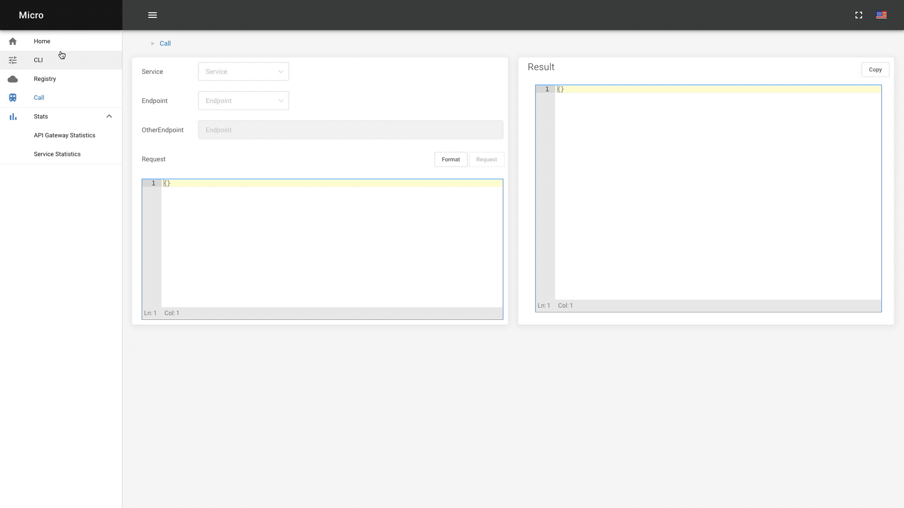
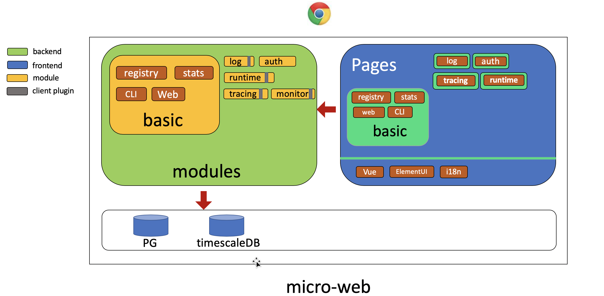

# Platform Web [In Progress]

Platform Web is a developer admin dashboard for Micro.

## Overview

The micro web dashboard provides simple access to services with the ability to explore and interact with them. Platform Web looks to go a step further providing a full featured developer admin dashboard with auth, metrics, monitoring and much more. Platform Web is a micro web app like any other but focused on providing a platform wide overview.

## Demo

## Architecture

## content

- [benchmarks](./benchmarks) benchmark tests
- [common](./common) common utils/libs
- [docs](./docs) documents
- [modules](./modules) module plugins
- [srv](./srv) backend-api
- [web](./web) basic front-page framework

# 内容

Platform Web是Micro的控制台。

- [benchmarks](./benchmarks) 基准性能测试
- [common](./common) 通用工具库
- [docs](./docs) 文档目录
- [modules](./modules) 模块插件目录
- [srv](./srv) 后台api代码
- [web](./web) 前端基础框架及基础组件
