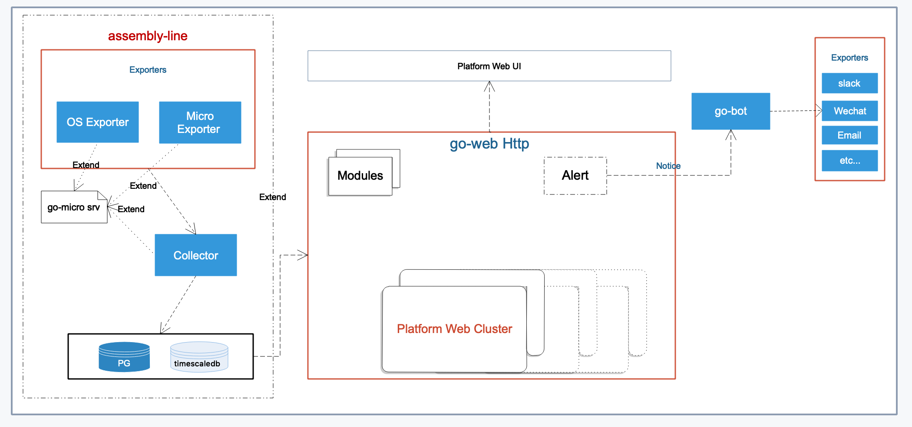

# Platform Web [In Progress]

Platform Web is a developer admin dashboard for Micro.

## Overview

The micro web dashboard provides simple access to services with the ability to explore and interact with them. Platform Web looks to go a step further providing a full featured developer admin dashboard with auth, metrics, monitoring and much more. Platform Web is a micro web app like any other but focused on providing a platform wide overview.

## Demo


## Architecture




## content

- [benchmarks](./benchmarks) benchmark tests
- [collector](./collector) a go-micro srv collecting statistic infos from exporters and saving data to db
- [common](./common) common utils/libs
- [docs](./docs) documents
- [exporters](./exporters) export infos to collector.
  - [os](./exporters/os) a go-micro srv exporting os and machine runtime infos to collector.
  - [micro](./exporters/micro) a plugin exporting infos of a running micro service to collector. It can be integrated into a micro service. 
- [modules](./modules) module plugins including basic (same as micro web), auth, log, etc.
- [srv](./srv) backend-api
- [web](./web) basic front-page framework

## Getting Started

### go run

```bash
cd srv
go run main.go module.go
```

then you can click [http://127.0.0.0:9082/platform][http://127.0.0.0:9082/platform] to open platform dashboard.

### go build

windows 

```bash
cd srv
GOOS=windows GOARCH=amd64 go build -o platform-web.exe main.go module.go
```

Linux

```bash
cd srv
GOOS=linux GOARCH=amd64 go build -o platform-web main.go module.go
```

you should keep the webapp dir and backend app in same path, like:

```bash

- platform-web
- webapp

```

# 内容

Platform Web是Micro的控制台。

- [benchmarks](./benchmarks) 基准性能测试
- [common](./common) 通用工具库
- [docs](./docs) 文档目录
- [modules](./modules) 模块插件目录
- [srv](./srv) 后台api代码
- [web](./web) 前端基础框架及基础组件
